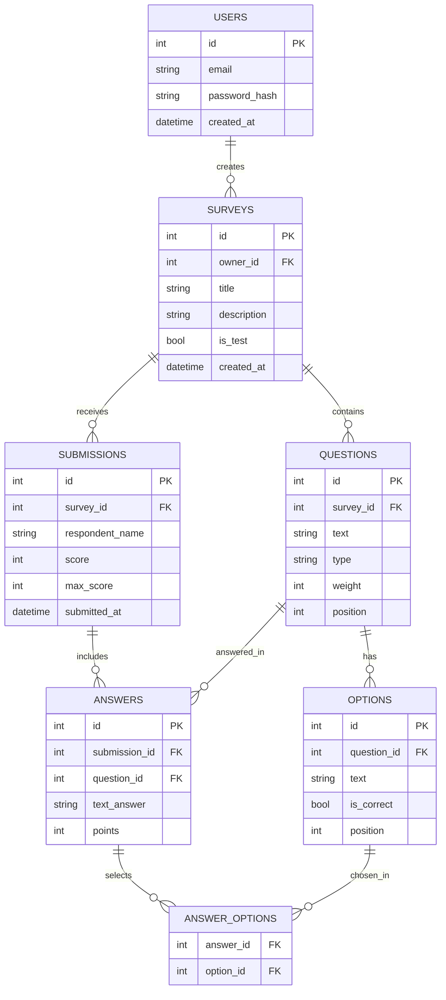

# Веб-приложение для опросов и тестирования

Бесплатный и функциональный инструмент для создания опросов и тестов с автоматической проверкой, гибкой настройкой вопросов и удобным интерфейсом.

## О проекте

SurveyApp решает проблему существующих сервисов (Google Forms, Typeform, SurveyMonkey), которые либо перегружены функциями, либо закрывают нужный функционал за платной подпиской. Приложение предоставляет простой и мощный инструмент для создания тестов с автопроверкой, настройкой весов вопросов и частичных баллов.

## Возможности

- **Конструктор с Drag-and-Drop** — перетаскивайте вопросы мышкой для изменения порядка
- **Все типы вопросов** — один вариант, несколько вариантов, текст, шкала, выпадающий список
- **Режим тестирования** — автоматическая проверка ответов и подсчёт баллов
- **Гибкая система оценивания** — настройка весов вопросов и частичных баллов
- **REST API** — возможность интеграции с другими системами
- **Полностью бесплатно** — без урезания функций и платных подписок
- **Адаптивный дизайн** — работает на компьютерах и мобильных устройствах

## Технологический стек

### Backend
- **Python 3.11+** — основной язык разработки
- **Flask** — веб-фреймворк для создания REST API
- **Flask-SQLAlchemy** — ORM для работы с базой данных
- **PostgreSQL** (или SQLite) — реляционная база данных
- **Werkzeug** — хеширование паролей и утилиты

### Frontend
- **HTML5/CSS3** — структура и стилизация
- **JavaScript (ES6+)** — интерактивность и Drag-and-Drop
- **SortableJS** — библиотека для реализации drag-and-drop

### Инструменты разработки
- **Git & GitHub** — система контроля версий
- **Postman** — тестирование API
- **VS Code** — редактор кода

## API (черновик)

### Авторизация
| Метод | Адрес | Что делает |
|-------|-------|------------|
| POST | /auth/register | регистрация |
| POST | /auth/login | вход, возвращает токен |
| GET | /auth/me | данные текущего пользователя |

### Опросы (для автора, нужен вход)
| Метод | Адрес | Что делает |
|-------|-------|------------|
| GET | /surveys | список моих опросов (кабинет) |
| POST | /surveys | создать опрос |
| GET | /surveys/{id} | получить опрос целиком, с вопросами |
| PUT | /surveys/{id} | изменить название, настройки |
| DELETE | /surveys/{id} | удалить опрос |

### Вопросы (для автора, нужен вход)
| Метод | Адрес | Что делает |
|-------|-------|------------|
| POST | /surveys/{id}/questions | добавить вопрос в опрос |
| PUT | /questions/{id} | изменить вопрос |
| DELETE | /questions/{id} | удалить вопрос |
| PUT | /surveys/{id}/questions/order | сохранить новый порядок (drag-and-drop) |

### Прохождение (публичное, вход не нужен)
| Метод | Адрес | Что делает |
|-------|-------|------------|
| GET | /public/surveys/{id} | получить опрос для прохождения |
| POST | /public/surveys/{id}/submissions | отправить ответы, получить результат |

### Результаты (для автора, нужен вход)
| Метод | Адрес | Что делает |
|-------|-------|------------|
| GET | /surveys/{id}/submissions | список всех прохождений |
| GET | /surveys/{id}/stats | статистика по вопросам |

## Схема базы данных

